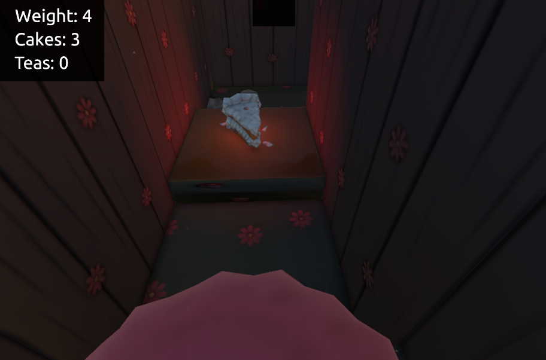
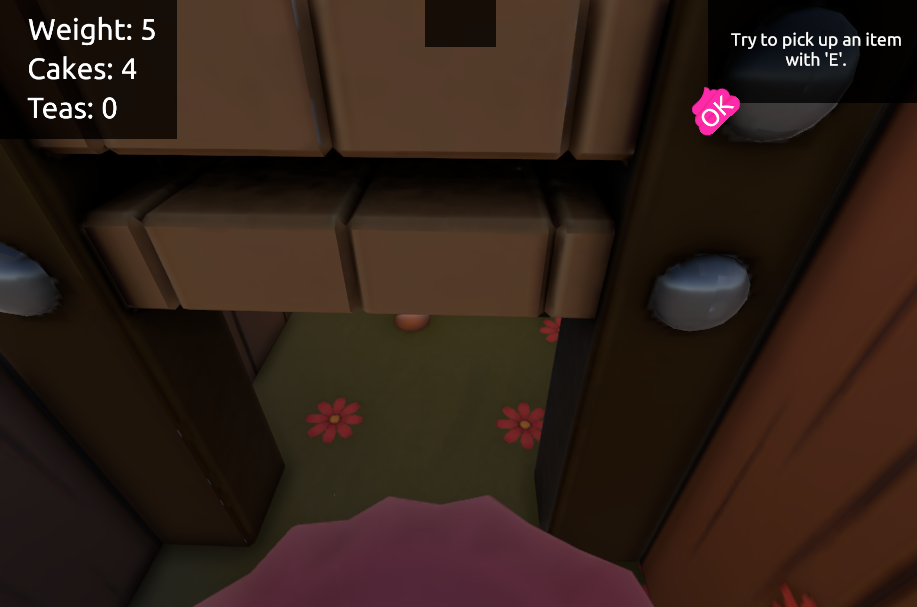

# The Big Nom

## A Ludum Dare 40 Game Jam project

#### Description

You incarnate a greedy princess that wants to eat every cakes in her light of sight. The problem is that the more she eats, the heaviest she gets and becomes unable to jump and go on tiny spaces.

Will you be able to find and reach the Ludum Dare flag?

#### [LD Jam page](https://ldjam.com/events/ludum-dare/40/chubby-princess)  

#### [Windows Build](https://linko3d.itch.io/princess-cake)

#### [Web Build](https://linko-3d.github.io/LD40/)

#### Preview

##### Gameplay video

##### Screenshots

#### Team

- 3D Graphics

  [Danyl Bekhoucha (Linko)](https://ldjam.com/users/danyl/)

- Level Design

  [Danyl Bekhoucha (Linko)](https://ldjam.com/users/danyl/)   
  [Angelos Kyriakopoulos](https://github.com/AngelKyriako)   
  
- Audio

  [Aurélien Montéro](www.aurelienmontero.com)

- Programming

  [Angelos Kyriakopoulos](https://github.com/AngelKyriako)   
  [Max Karpinsky (Pixel Lifetime)](https://github.com/MaxKarpinsky)

#### Tools

- Engine
 
  [Unity](https://unity3d.com/)
 
- Modeling

  [Blender](https://blender.org/)
 
 #### Change Log

- 5-12-2017 v1 Core Gameplay and Graphics [Jam Deadline] 
- 6-12-2017 v1.1 Level Design update, Background & Player Graphics and UI update.
- 9-12-2017 v1.2 Checkpoint state, Lights Update, UI update and Localization system.
