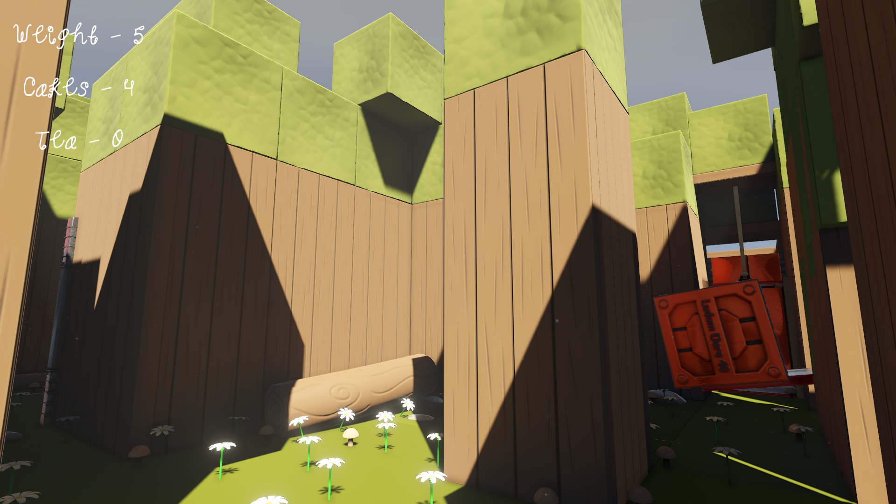

# Princess Cake

## A Ludum Dare 40 Game Jam project

#### Description

You incarnate a greedy princess that wants to eat every cakes in her light of sight. The problem is that the more she eats, the heaviest she gets and becomes unable to jump and go on tiny spaces.

Will you be able to find and reach the Ludum Dare flag?

#### [LD Jam page](https://ldjam.com/events/ludum-dare/40/chubby-princess)  

#### [Windows Build](https://linko3d.itch.io/princess-cake)

#### Preview

#### Team

- 3D Graphics

  [Danyl Bekhoucha (Linko)](https://ldjam.com/users/danyl/)

- Level Design

  [Danyl Bekhoucha (Linko)](https://ldjam.com/users/danyl/)

- Audio

  [Aurélien Montéro](https://ldjam.com/users/aurelien-montero/)

- Programming

  [Angelos Kyriakopoulos (angelkyriako)](https://github.com/AngelKyriako)   
  [Max (Pixel Lifetime)](https://ldjam.com/users/pixel-lifetime)

#### Tools

 Engine: Unity  
 Modeling: Blender
 