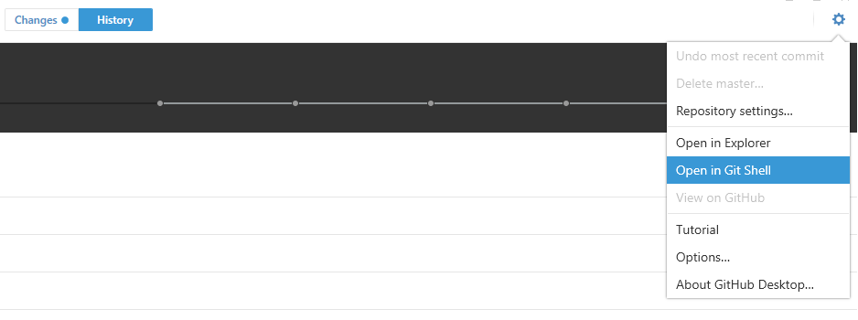

# Princess Cake Web

#### Prerequisites

- Install [node.js](https://nodejs.org/en/) and add it to system path.
- Make a Unity build for WebGL target and put it in the public folder.

#### Run the Server

- Open a shell

*Example for Github Desktop App.*



- Navigate to the server directory
  ```
  cd Web
  ```

- Start the server

  ```sh
  npm start
  ```